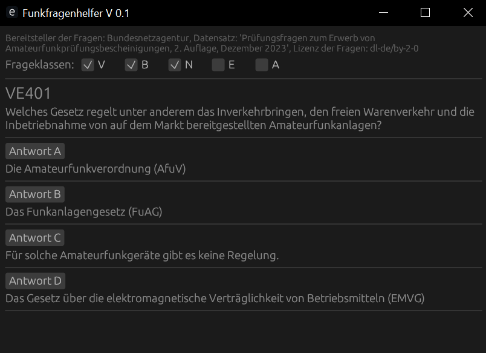

# Funkfragenhelfer



Dieses kleine Programm kann eine Unterstützung beim Lernen für die deutsche Amateurfunkprüfung der Klassen N, E und/oder A sein. Hierbei werden Fragen, die man falsch beantwortet hat, mit einer erhöhten Wahrscheinlichkeit wieder abgefragt im Vergleich zu den Fragen, die man schon häufiger richtig beantwortet hat.

Programmatisch ist der Funkfragenhelfer in Rust geschrieben, außer einem kleinen Pythonskript, welches den ursprünglichen Fragenkatalog in ein für den Funkfragenhelfer leichter lesbares Format umwandelt, und nutzt die Bibliotheken eframe, egui und egui-extras für die graphische Benutzeroberfläche, rayon für ein wenig Parallelisierung und serde bzw. serde-json für die (De)serialisierung von JSON-Dateien. Dies ist eines meiner ersten in Rust verfassten Programme, daher gibt es im Code wahrscheinlich ein großes Verbesserungspotential. Erweiterte Kommentare folgen in späteren Versionen.

## Installation

Unter Windows ist der einfachste Weg, die .zip-Datei [im letzten Release](https://github.com/Paulocracy/Funkfragenhelfer/releases/latest) herunterzuladen, an einem beliebigen Ort zu entpacken und dann im entpackten Ordner "Funkfragenhelfer" die "funkfragenhelfer.exe" auszuführen.

Unter anderen, vom Autor bislang nicht getesteten, Systemen (wie Linux und MacOS) empfiehlt sich die Nutzung von Git und cargo, hierfür kloniert man zunächst das Repository:

```sh
git clone https://github.com/Paulocracy/Funkfragenhelfer
```

...und kompiliert und führt das Programm mit Cargo aus:

```sh
cd Funkfragenhelfer # Falls man noch nicht im neu erstellten Ordner ist
cargo run
```

## Lizenzen

Als Quelle für die hier genutzten Fragen dient der von der von der Bundesnetzagentur für Elektrizität, Gas,
Telekommunikation, Post und Eisenbahnen bereitgestellte Datensatz "Prüfungsfragen zum Erwerb von Amateurfunkprüfungsbescheinigungen, 2. Auflage, Dezember 2023", der über [[diesen Link (Stand: Januar 2024)]](https://www.bundesnetzagentur.de/SharedDocs/Downloads/DE/Sachgebiete/Telekommunikation/Unternehmen_Institutionen/Frequenzen/Amateurfunk/Fragenkatalog/PruefungsfragenZIP.zip) bezogen wurde und unter den Bedingungen der ["Datenlizenz Deutschland – Namensnennung – Version 2.0"](https://www.govdata.de/dl-de/by-2-0) lizenziert ist. Der Datensatz selber ist in diesem Repository im Unterordner "resources/fragenkatalog" auffindbar.

Das Programm selber, ohne den Prüfungskatalog, ist unter der Apache-Lizenz 2.0 lizensiert, welche in der Datei LICENSE abgerufen werden kann.
