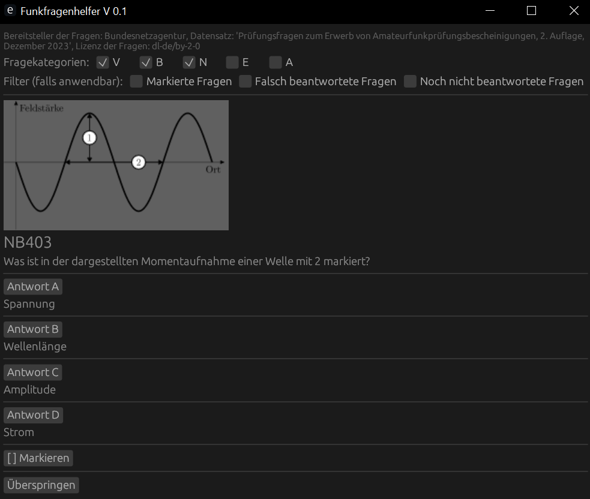

# Funkfragenhelfer



Dieses kleine Programm kann einem beim Lernen für die deutsche Amateurfunkprüfung der Klassen N, E und/oder A helfen. Die gestellten Fragen entstammen aus dem offizielle Fragenkatalog der Bundesnetzagentur (siehe auch Abschnitt [Lizenzen](#lizenzen)). Hierbei kann man sich auf Fragen der Kategorien V (Vorschriften), B (Betriebliches), N (Technik Klasse N), E (Technik Klasse E) und/oder A (Technik Klasse A) konzentrieren.

Um den Lernfortschritt zu unterstützen, bietet der Funkfragenhelfer die Möglichkeit, die gestellten Fragen zu filtern, dabei lassen sich folgende Filterinstellungen frei kombinieren (falls solche Kombinationen bestehen):

* Von einem markierte Fragen (dies bietet sich bspw. für schwere Fragen an)
* Fragen, die man mindestens einmal falsch beantwortet hat
* Fragen, die man noch nicht beantwortet hat

Mit aktiven Filtern, falls Fragen die zu den Filtern passen existieren, wird eine zufällige passende Frage aus den ausgewählten Fragekategorien gestellt. Ohne aktive Filter, oder wenn keine Frage zu den aktiven Filtern passen, werden alle Fragen der ausgewählten Fragekategorien, die man falsch beantwortet hat, mit einer erhöhten Wahrscheinlichkeit wieder abgefragt im Vergleich zu den Fragen, die man schon häufiger richtig beantwortet hat.

Programmatisch ist der Funkfragenhelfer in Rust geschrieben (außer einem kleinen, für das Starten des Funkfragenhelfers nicht notwendiges, Pythonskript, welches den ursprünglichen Fragenkatalog in ein für den Funkfragenhelfer leichter lesbares Format umwandelt), und nutzt die Bibliotheken [egui](https://github.com/emilk/egui), [eframe](https://docs.rs/eframe/latest/eframe/) sowie [egui-extras](https://docs.rs/egui_extras/latest/egui_extras/) für die graphische Benutzeroberfläche, [rayon](https://github.com/rayon-rs/rayon) für ein wenig Parallelisierung und [serde](https://github.com/serde-rs/serde) bzw. [serde_json](https://docs.rs/serde_json/latest/serde_json/) für die (De)serialisierung von JSON-Dateien. Dies ist eines meiner ersten in Rust verfassten Programme, daher gibt es im Code wahrscheinlich große Verbesserungspotentiale.

Wer einen kompletten Lehrgang für die Amateurfunkprüfung, und alternative Apps mit mehr Funktionen und mehr unterstützten Systemen, für die Amateurfunkprüfung sucht, dem empfehle ich [50Ω](https://50ohm.de/) aus den Reihen des Deutschen Amateur-Radio-Clubs (DARC). Der hiesige kleine Funkfragenhelfer steht in keiner Verbindung zu 50Ω.

## Installation

Unter Windows ist der einfachste Weg, die .zip-Datei "Funkfragenhelfer_Windows.zip" [im letzten Release](https://github.com/Paulocracy/Funkfragenhelfer/releases/latest) unter "Assets" herunterzuladen, an einem beliebigen Ort zu entpacken und dann im entpackten Ordner "Funkfragenhelfer" die "funkfragenhelfer.exe" auszuführen.

Unter anderen, vom Autor bislang nicht getesteten, Systemen (wie Linux und MacOS) empfiehlt sich die Nutzung von Git und cargo, hierfür kann man z.B. im Terminal zunächst das Repository clonen per

```sh
git clone https://github.com/Paulocracy/Funkfragenhelfer
```

und kompiliert und führt das Programm dann mit Cargo aus:

```sh
cd Funkfragenhelfer # Falls man noch nicht im von Git neu erstellten Ordner ist
cargo run
```

## Lizenzen

Als Quelle für die hier genutzten Fragen dient der von der von der Bundesnetzagentur für Elektrizität, Gas,
Telekommunikation, Post und Eisenbahnen bereitgestellte Datensatz "Prüfungsfragen zum Erwerb von Amateurfunkprüfungsbescheinigungen 3. Auflage, März 2024", der über [diesen Link (Stand: Januar 2024)](https://www.bundesnetzagentur.de/SharedDocs/Downloads/DE/Sachgebiete/Telekommunikation/Unternehmen_Institutionen/Frequenzen/Amateurfunk/Fragenkatalog/PruefungsfragenZIP.zip) bezogen wurde und unter den Bedingungen der ["Datenlizenz Deutschland – Namensnennung – Version 2.0"](https://www.govdata.de/dl-de/by-2-0) lizenziert ist. Der Datensatz selber ist in diesem Repository im Unterordner "resources/fragenkatalog" auffindbar.

Der Funkfragenhelfer selber, ohne den Prüfungskatalog, ist unter der Apache-Lizenz 2.0 lizensiert, welche in der Datei [LICENSE](./LICENSE) abgerufen werden kann.
